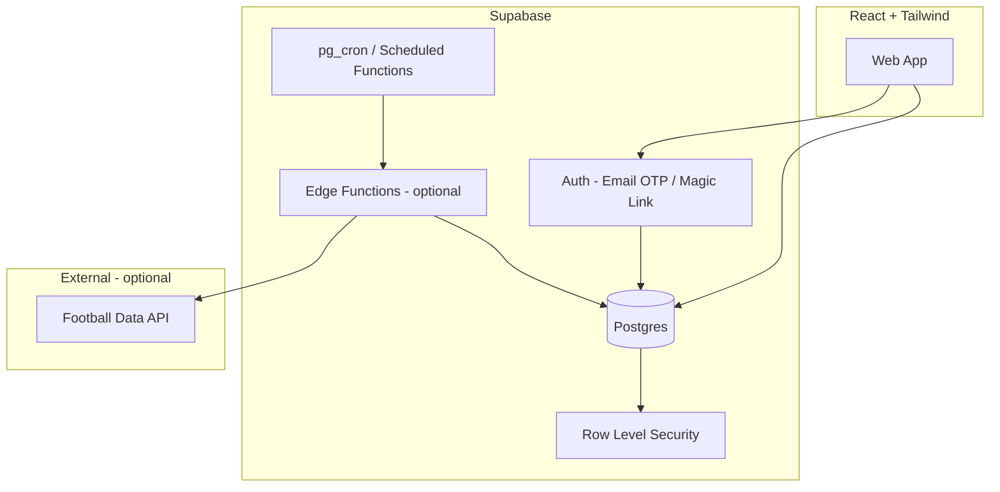
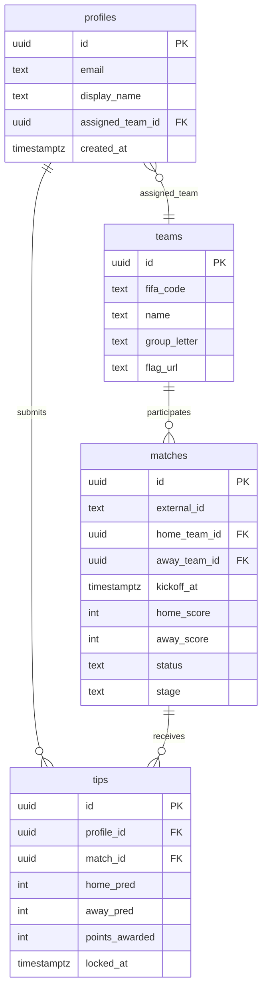

# World Cup 2026 Tipping Pool — Product & Technical Plan

**Project:** World-Cup-2026---Cooper  
**Status:** Planning (awaiting your decisions)  
**Last updated:** 2026-06-02  

---

## 1. End goal (agreed direction)

Build a **private tipping pool** for World Cup 2026 where:

- **Multiple separate users** each have their own account and identity in the app.
- Users **submit tips/predictions** before matches lock.
- A **leaderboard** ranks participants as results come in.
- **Supabase** is the backend (Postgres + Auth + optional Edge Functions).
- **Auth is lightweight:** email-based sign-in only (no social OAuth required).
- **Frontend:** React + Tailwind CSS.
- On **first authorization**, each user is **automatically assigned** a national team (see §6 — this is a core design area when you have **more than 48 users**).

**Tournament facts that shape the product:**

| Item | Detail |
|------|--------|
| Teams | 48 nations |
| Groups | 12 × 4 (A–L) |
| Group matches | 72 |
| Knockout | Round of 32 → Final |
| Total matches | **104** |
| Dates | 11 Jun – 19 Jul 2026 |

---

## 2. What we still need you to confirm

These are **blocking product decisions**. Please answer inline (reply in chat or annotate this doc).

### 2.1 Look and feel

| # | Question | Options / notes |
|---|----------|-----------------|
| L1 | **Overall vibe?** | A) Official FIFA-adjacent (greens, trophy motifs) · B) Casual pub sweepstakes · C) Minimal dashboard (data-first) · D) You provide reference screenshots |
| L2 | **Dark vs light?** | Light only · Dark only · System toggle |
| L3 | **Mobile priority?** | Mobile-first (recommended for live tipping) · Desktop-first · Equal |
| L4 | **Branding** | Pool name, logo, accent colour(s), optional “Cooper” branding |
| L5 | **UI kit** | Plain Tailwind · **Tailwind + shadcn/ui** (recommended for speed) · Headless UI · Other |
| L6 | **Tone of copy** | Formal · Banter-friendly · Mixed |

**Recommendation:** Mobile-first, dark/light toggle, shadcn/ui + Tailwind, casual-competitive tone (not corporate).

**Developer Response 2.1: Mobile-first, dark/light toggle, shadcn/ui + Tailwind, casual-competitive tone (not corporate). "Overall Vibe" Align it with a Fifa Adjacent feel

---

### 2.2 Fixtures & results — automatic refresh?

| # | Question | Options |
|---|----------|---------|
| R1 | **Who updates match results?** | See §5 — this is the main fork |
| R2 | **How fresh must scores be?** | Live (minute-by-minute) · Within 15 min of FT · Daily batch · Manual only |
| R3 | **Budget for external APIs?** | $0 · Low (~$10–30/mo) · Whatever it takes |
| R4 | **If API fails mid-tournament?** | Admin manual override (required fallback) · Pause leaderboard · Email alert |

**Recommendation:** Automated sync via a football data API on a schedule (e.g. every 5–15 minutes during match windows) **plus** an admin “override score” screen. Live minute-by-minute is optional complexity for v1.

**Developer Response 2.2: Automated sync via a football data API on a schedule every 5mins during match windows **plus** an admin “override score” screen. stick to a low budget external API. 

---

### 2.3 What is a “tip”?

| # | Question | Options |
|---|----------|---------|
| T1 | **Prediction type** | A) Exact score (e.g. 2–1) · B) Result only (W/D/L) · C) Both with different points · D) Knockout bracket pick (separate game) |
| T2 | **Which matches?** | All 104 · Group stage only · Knockout only · Configurable per pool |
| T3 | **Lock rule** | At kickoff · 1 hour before · Admin lock per round |
| T4 | **Edits after submit?** | Locked at kickoff · Editable until lock · Unlimited until lock |
| T5 | **Scoring** | You define points (see §4.3) — need your preferred table |

**Developer response 2.3: Users will be assigned a team which will remain their team for the whole tournament eg constantly picked. They will receive points for every match the assinged team plays in. Points will be assigned based on betting odds on a per game basis. Eg If Argentina wins and has 2:1 chance to win, the player gets 2 points. There needs to be two leaderboards, the where the teams are ranked in terms of what stage of the competion they get to and where they sit in their groups. Team that wins the world cup first, runner - up second, team that scores the least total points (from wins, draws, losses) from the start of the comp comes last etc. A seperate leaderboard needs to exist where points are counted based on betting odds, so if a smaller/lower ranked team with low chance to win individual matches have a high win rate they have chance to place higher on the second leaderboard. 
---

### 2.4 Pool structure & users

| # | Question | Options |
|---|----------|---------|
| P1 | **One pool or many?** | Single global pool · Multiple leagues (e.g. “Work”, “Family”) |
| P2 | **Who can join?** | Invite-only (email allowlist) · Open signup with secret link · Admin approves each user |
| P3 | **Expected headcount?** | e.g. 20 / 48 / 60 / 100+ |
| P4 | **Display names** | Real name · Nickname · Email hidden on leaderboard |
| P5 | **Roles** | Player only · Player + Admin · Super-admin (you) |

**Developer response 2.4: P1 - Many possible pools. A host will set a competition up and send invites via a URL to email, whatsapp etc. Expected headcount is unknown, however if players are >48 teams will need to be assinged to >1 person. Ensure all teams are assigned before double ups occur. User enters a chosen name. Player only and Super-Admin. 
---

### 2.5 “Assigned team” — what does it mean?

This is critical because you mentioned **48+ users** and **sharing teams**.

| # | Question | What we need to know |
|---|----------|----------------------|
| A1 | **Purpose of assigned team?** | A) **Loyalty / flair** (avatar, sidebar) · B) **Scoring bonus** (extra points when your team wins) · C) **Side competition** (“Team owners” leaderboard) · D) **Restriction** (you only tip matches involving your team) — unusual |
| A2 | **Can two users refuse to share?** | Must be unique per user · Sharing allowed · Optional “co-manager” pairs |
| A3 | **When is assignment final?** | On signup · After email verified · Admin can reassign until tournament starts |

**Please pick A1 explicitly** — it drives database design and fairness rules.

**Developer response 2.5: Automatic assigning of teams is just for fairness. See response 2.3 for scoring system. You only score points for matches your team is automatically assigned to. Assignment is decided and final on signup, admin can reassign at any stage. 

---

## 3. Recommended architecture (pending your approval)

| Layer | Choice | Rationale |
|-------|--------|-----------|
| Frontend | **Vite + React + TypeScript** | Fast dev, fits “React + Tailwind” without forcing Next.js |
| Styling | **Tailwind CSS 4** + optional shadcn/ui | Rapid, consistent UI |
| State | TanStack Query | Server state, cache, refetch after results |
| Backend | **Supabase** | Auth, DB, RLS, cron in one place |
| Auth | **Email OTP or Magic Link** | “Loose auth” — no password management |
| Hosting | Vercel / Netlify / Cloudflare Pages | Static SPA + env keys |

**Developer response 3: Stick to the recommended architecture

**Alternative path:** Next.js App Router + Supabase SSR if you want SEO or server components later — heavier for a friends-only pool.

---

## 4. Tipping mechanics — options to choose

### 4.1 Scoring models (examples)

**Model A — Simple (good for v1)**

| Prediction | Points |
|------------|--------|
| Correct result (W/D/L) | 1 |
| Correct goal difference | +1 |
| Exact score | +2 |

**Model B — FIFA-style weighted**

| Prediction | Points |
|------------|--------|
| Exact score | 3 |
| Correct scoreline but wrong winner (rare) | 0 |
| Correct outcome + correct goals for one side | 1 |
| Correct outcome only | 1 |

**Model C — Knockout extras**

- Group stage: Model A or B  
- Knockout: Bonus for predicting correct winner + optional “advancement bracket” at start of R32  

**Your call:** Reply with point values or “use Model A”.

### 4.2 Leaderboard behaviour

- **Overall** points across all tipped matches  
- **Per stage** (group / knockout) — optional tabs  
- **Streak** or **accuracy %** — nice-to-have  
- **Tie-breakers:** most exact scores → most correct outcomes → earliest signup  

### 4.3 Special rules for 2026 format

- **Third-place qualifiers:** Users do **not** need to predict “which 3rd place teams advance” unless you add a **bonus question** round before R32.  
- **104 matches:** Consider tipping **only group stage (72)** for v1 to reduce fatigue, unless your group is keen.

**Developer response 4: See previous responses for how scoring is to work. Two leaderboards, one for overall place in the competition. One for points based on betting odds so lower ranked teams can get higher scores. 

---

## 5. Fixtures & results — development paths

### Path A — Manual admin (simplest, $0)

| Pros | Cons |
|------|------|
| No API cost or ToS | You must update 104 results (or delegate) |
| Full control | Delays if admin is busy |
| Works offline from vendors | No “live” feel |

**Implementation:** Admin UI → `matches` table `home_score`, `away_score`, `status`. Leaderboard recalculates on update.

---

### Path B — Scheduled API sync (recommended)

| Pros | Cons |
|------|------|
| Hands-off during tournament | API key + cost |
| Consistent lock times | Mapping team names to FIFA codes |
| Can run every 5–15 min on match days | Rate limits |

**Flow:**

1. Edge Function (or cron) calls provider.  
2. Upsert `matches` by external `fixture_id`.  
3. Trigger or app logic recalculates `tip_points`.  
4. Admin override remains for disputes.

**Provider examples** (verify 2026 coverage & pricing before committing):

| Provider | Notes |
|----------|--------|
| [API-Football](https://www.api-football.com/) | Popular; check World Cup plan tier |
| football-data.org | Free tier limited; may not cover WC 2026 on free |
| SportMonks | Paid tiers for major tournaments |

**Interrogation:**

- Are you willing to **pay for an API** for 6 weeks?  
- Is **15-minute delay** after full-time acceptable?  
- Do you need **live scores during matches** or only final results?

---

### Path C — Hybrid (recommended for Cooper pool)

- **Automatic** sync for schedule + results.  
- **Admin** can correct a match and re-run scoring.  
- **Notifications** (optional v2): email when your tip is scored or you move on leaderboard.

**Developer response 5: Path C — Hybrid (recommended for Cooper pool) - willing to sign up to an API for 6 weeks, 15 minute delay after fulltime is acceptable, only final results. I belive aforementioned betting odds are available in the api-football.com API. We need to ensure it runs as a Server-to-API Request to limit the number of requests made per day. Limit the requests to for scores/results to only after the match is completed. Limit the requests for betting odds to update 2 hrs before the matches start.  
---

## 6. More than 48 users — team assignment strategies

There are exactly **48 national teams** in the tournament. If **more than 48 users** join, **at least two users must share the same assigned team** (pigeonhole principle).

### 6.1 Strategies (compare and choose)

| ID | Strategy | How it works | Fairness | UX |
|----|----------|--------------|----------|-----|
| S1 | **Pure random** | On signup, assign random team from 48; allow duplicates | Equal chance per team | Simple; may cluster (e.g. 5 on Brazil) |
| S2 | **Balanced random** | Assign to team with **fewest** current owners; random tie-break | Spreads co-managers evenly | **Recommended default** |
| S3 | **Round-robin queue** | User #1 → team 1, … #48 → team 48, #49 → team 1 again | Perfectly even (2 per team at 96 users) | Predictable order; early joiners get “first” team |
| S4 | **User picks from available** | Show teams with slots; auto-pick if none chosen in 60s | Users feel control | Needs “max per team” config |
| S5 | **Co-manager pairs** | Explicitly assign User A + User B as “Argentina co-managers” | Social | Extra UI; good for friends |
| S6 | **Waitlist at 48** | Cap pool at 48 unique teams | No sharing | **Rejects** your 48+ requirement |
| S7 | **Multiple pools** | Pool A max 48, spin Pool B | No sharing within pool | Ops overhead |

**Recommendation:** **S2 (balanced random)** on authorization, with:

**Developer response 6.1: Set up a "Round Robin queue" The first joiner gets assigned a team randomly (48 teams) (equal chance per team) and then the next joiner gets assigned a team minus the possbility of the team that has already been assigned to the first user (47 teams). Once all teams have been assigned user # 49 gets assigned a random team from the full list of 48 teams etc etc. Provide this message for the instance of co managing - Display: “You’re co-managing **Japan** with @alex and @sam (3 owners)”.  

- `teams.max_owners` optional (e.g. max 3 per nation for 144 users).  
- Display: “You’re co-managing **Japan** with @alex and @sam (3 owners)”.  
- Side leaderboard: sum of **all co-managers’** main tipping points, or average — **you must choose**.

### 6.2 Open questions on shared teams

| # | Question |
|---|----------|
| C1 | Max co-managers per nation? (e.g. unlimited vs cap at 3) |
| C2 | Co-manager leaderboard uses **sum**, **average**, or **best** of the group? |
| C3 | Should co-managers see each other’s tips before lock? (Usually **no**) |
| C4 | Reassignment if someone drops out? Admin only? |

**Developer response 6.2: 
C1: Unlimited
C2: No changes to scoring for co-managers. Scoring applied to user, the co-managed team will just appear in the leaderboard as per a single managed team. However the manager name will have both users attached. 
C3: No
C4: No automatic reassingment, Admin decision. 
---

## 7. Authentication — “loose email auth” paths

| Path | Description | Security | Effort |
|------|-------------|----------|--------|
| **E1 Magic link** | User enters email → clicks link → session | Good; no password | Low |
| **E2 Email OTP** | 6-digit code to email | Good | Low |
| **E3 Email + password** | Traditional | Medium; not “loose” | Medium |
| **E4 Email only (no verify)** | Type email → logged in | **Poor** — anyone can impersonate | Not recommended |

**Recommendation:** **E1 or E2** via Supabase Auth.

**Developer response 7: E1 

### 7.1 Access control add-ons

| Add-on | Purpose |
|--------|---------|
| **Allowlist** | Only pre-approved emails in `pool_members` can sign up |
| **Invite token** | URL `?invite=xyz` required once |
| **Domain restriction** | e.g. `@yourcompany.com` only |

**Interrogation:** Should **anyone with the link** join, or only people you add by email first?

**Developer response 7.1: Anyone with the link can join. Links shared are tied back to the group set up by the host. Eg a group that Cooper people will recieve and a group that family recieve need seperate links. 

---

## 8. Data model (draft)

Entities below assume **single pool**; extend with `pool_id` if multi-league.

**Supabase RLS (principles):**

- Users read all `matches`, `teams`, aggregated leaderboard.  
- Users **insert/update own** `tips` only before `kickoff_at`.  
- Only **admin role** updates `matches` scores (unless Edge Function uses service role for API sync).

---

## 9. Screen map (v1 vs v2)

### v1 — MVP (tournament-ready)

| Screen | Purpose |
|--------|---------|
| Login | Email magic link / OTP |
| Onboarding | Display name; show assigned team |
| Dashboard | Next matches, your open tips, quick submit |
| Match list | Filter by date / stage / group |
| Tip form | Score or outcome picker |
| Leaderboard | Points, rank, ties |
| My profile | Team assignment, stats |
| Admin | Enter/override results, sync status, member list |

### v2 — Enhancements

| Feature | Notes |
|---------|--------|
| Push / email reminders | Before lock |
| Bracket challenge | Pre-knockout picks |
| Head-to-head | Compare two users |
| Export CSV | End-of-tournament |
| Chat / comments | Moderation burden |

---

## 10. Implementation phases

### Phase 0 — Decisions (you)

- Answer §2, §4, §5, §6, §7 questions.  
- Confirm look-and-feel direction (§2.1).  
- Confirm auto vs manual results (§5).

### Phase 1 — Foundation

- Supabase project, schema, RLS, seed 48 teams + match schedule (when final).  
- React app scaffold, auth flow, profile + **auto team assignment** on first login.

### Phase 2 — Core tipping

- Match list, tip CRUD, lock at kickoff, scoring function, leaderboard.

### Phase 3 — Results pipeline

- Admin overrides **or** API sync + cron.  
- Recalculate points job.

### Phase 4 — Polish

- UI pass per your L1–L6 answers, mobile QA, error states, admin docs.

### Phase 5 — Launch ops

- Allowlist/import users, dry-run with fake matches, go-live before 11 Jun 2026.

---

## 11. Risks & mitigations

| Risk | Mitigation |
|------|------------|
| Schedule changes / wrong API data | Admin override + audit log |
| Users tip after kickoff | Server-side lock in RLS + Edge Function validation |
| 48+ users confused by shared team | Clear copy + co-manager list on profile |
| API cost overrun | Cache responses; sync only on match days |
| GDPR / privacy | Minimal PII (email + display name); privacy note |

---

## 12. Decision log (fill as you answer)

| Topic | Your decision | Date |
|-------|---------------|------|
| Look & feel | _pending_ | |
| Results refresh | _pending_ | |
| Tip type & scoring | _pending_ | |
| Assigned team purpose | _pending_ | |
| 48+ user strategy | _pending_ | |
| Auth variant | _pending_ | |
| Join policy | _pending_ | |
| React framework | _pending_ (Vite vs Next) | |

---

## 13. Questionnaire — copy/paste and reply

Please answer in chat (numbered). Short answers are fine.

1. **Look (L1–L6):** Vibe, dark/light, mobile priority, colours, shadcn yes/no?  
2. **Results (R1–R4):** Auto API, manual, or hybrid? Live vs after FT? API budget?  
3. **Tips (T1–T5):** Exact score or W/D/L? All 104 matches? Lock rule? Point table?  
4. **Pool (P1–P5):** Single or multi pool? Invite-only? Expected user count?  
5. **Assigned team (A1–A3):** Flair, bonus points, or side comp? Max co-managers?  
6. **48+ strategy:** S1–S7 from §6.1 (or mix). Co-manager leaderboard: sum/average/best?  
7. **Auth (E1–E4 + allowlist):** Magic link vs OTP? Open link vs allowlist?  
8. **Admin:** Who are admins besides you?  
9. **Timeline:** Must MVP be ready before first match (11 Jun 2026)? Any hard internal deadline?  
10. **Anything else:** Grand final party rules, prizes, disqualification, etc.?

I believe the Questionaire has been responded to throughout the plan.md file. Refer to 'Developer Responses' lines. 

---

## 14. Next step after you answer

1. Lock decisions in §12.  
2. Produce **technical spec v2** (migrations, API choice, exact RLS policies).  
3. Begin **Phase 1** implementation on branch `cursor/world-cup-tipping-impl-6427`.

---

*This document is the living plan for World-Cup-2026---Cooper. Implementation should not start until §2 and §13 critical items are resolved.*
