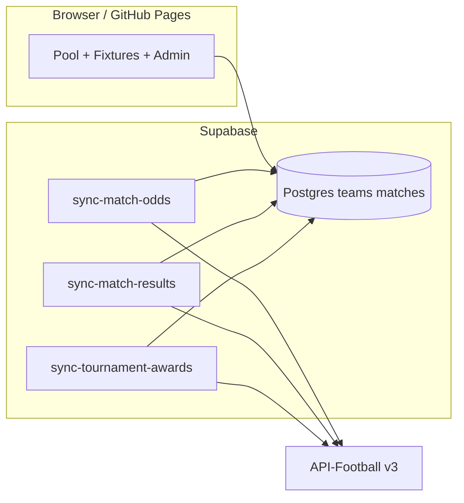

# API integration guide — ensuring live data works end-to-end

This document summarises how the World Cup 2026 pool connects to **API-Football** (server-side only) and what you must do so **every facet** works: match odds, finished scores, and **Golden Boot / Golden Glove** player names on the pool leaderboards.

---

## Architecture (one page)



| Facet | Edge function | API endpoints | DB fields |
|-------|---------------|---------------|-----------|
| Pre-match odds | `sync-match-odds` | `/odds?fixture={id}` | `match_odds`, `matches.odds_synced_at` |
| Final scores | `sync-match-results` | `/fixtures?league=1&season=2026&status=FT` | `matches` scores + `recalculate_pool_member_points` |
| Golden Boot (top scorer per nation) | `sync-tournament-awards` or tail of results sync | `/teams`, `/players/topscorers` | `teams.golden_boot_player_name`, `golden_boot_goals` |
| Golden Glove (best GK per nation) | same | `/players?team={api_team_id}` | `teams.golden_glove_player_name`, `golden_glove_clean_sheets` |
| Team link | same (first step) | `/teams?league=1&season=2026` | `teams.api_football_team_id` |

**Defaults:** `API_FOOTBALL_LEAGUE_ID=1`, `API_FOOTBALL_SEASON=2026`.

---

## Checklist — “will the API link work?”

Do these in order before relying on live leaderboards:

1. **Migrations** — Through `20260606000006` (award columns + `api_football_team_id`).
2. **Secrets** — `API_FOOTBALL_KEY` on the Supabase project; service role available to functions.
3. **Deploy functions** — All three sync functions (not deployed by GitHub Actions today).
4. **Fixture IDs** — For each match that should auto-update, set `matches.external_id` to API-Football `fixture.id` (seed data does not include these).
5. **Run awards sync** — `POST .../sync-tournament-awards` once after teams exist in API; repeat after match days (or rely on `sync-match-results`).
6. **Verify mapping** — SQL: `select count(*) from teams where api_football_team_id is not null;` → expect ~48.
7. **Verify names** — SQL below; pool UI should show player names, not placeholders.
8. **Schedule** — Cron: odds ~hourly; results ~5 min on match days; awards daily or bundled with results.

Detailed steps: [TestLiveAPI.md](./TestLiveAPI.md) and `scripts/test-live-api.sh`.

---

## Golden Boot & Golden Glove — why names look wrong today

### What you see

On pool leaderboards, many rows still show:

- **Golden Boot:** `Squad forward`
- **Golden Glove:** `No. 1 goalkeeper`

Those strings are **intentional database placeholders**, not API data.

### Where placeholders come from

Migration `20260605000005_prompt006.sql` seeds display text so boards are never empty before real stats exist:

```sql
golden_boot_player_name = coalesce(golden_boot_player_name, 'Squad forward'),
golden_glove_player_name = coalesce(golden_glove_player_name, 'No. 1 goalkeeper')
```

The UI reads these columns via `leaderboard_golden_boot` / `leaderboard_golden_glove`. Until something **overwrites** them, placeholders remain visible everywhere.

### What must happen for real player names

Real names are written only by:

1. **`sync-tournament-awards`** (or the awards step inside **`sync-match-results`**), which:
   - Maps each national team → `api_football_team_id` via `/teams?league=1&season=2026` (with FIFA-code aliases + name fallback in `_shared/fifa-code-map.ts`).
   - Sets Golden Boot from `/players/topscorers` (best goals per API team id).
   - Sets Golden Glove from `/players?team={id}` (goalkeeper with most clean sheets, then saves).
2. **Admin → Team awards** — manual override if API is empty or wrong.

### Common reasons sync does not replace placeholders

| Cause | Symptom | Fix |
|-------|---------|-----|
| Edge functions not deployed | Invoke returns 404 | `supabase functions deploy ...` |
| Missing `API_FOOTBALL_KEY` | 500 “Missing env configuration” | Set secret, redeploy |
| Awards sync never run | `awards_synced_at` null | POST `sync-tournament-awards` |
| `api_football_team_id` null | `teamIds` ≪ 48 in JSON response | Fix FIFA↔API mapping; check `/teams` response; extend `fifa-code-map.ts` |
| Top scorers empty pre-tournament | `scorers: 0` | Normal until goals exist in API; placeholders stay until then |
| Top scorers empty but tournament started | API plan/coverage | Check `/leagues?id=1&season=2026` coverage |
| Team not mapped | That nation keeps placeholder | Map `api_football_team_id`; re-run sync |
| GK stats missing clean sheets | Glove name may not update | Use admin override; API field layout varies by season |

### Summary sentence (for stakeholders)

**Player names on Golden Boot and Golden Glove boards are placeholders until the awards sync successfully maps all 48 teams to API-Football IDs and the API returns topscorer/goalkeeper statistics; the app does not invent player names client-side.**

---

## Odds & results (non-award facets)

Same prerequisites as awards:

- **`external_id`** on `matches` must match API fixture ids.
- Sample/demo matches inserted without `external_id` are **admin-only** for scores/odds unless you backfill ids from `/fixtures?league=1&season=2026`.

Example backfill pattern (run in SQL after importing fixture list):

```sql
-- Illustrative: set external_id for a known pairing
update matches m
set external_id = '1234567'
from teams th, teams ta
where m.home_team_id = th.id and m.away_team_id = ta.id
  and th.fifa_code = 'NED' and ta.fifa_code = 'JPN';
```

---

## Monitoring a sync run

Successful `sync-tournament-awards` body:

```json
{
  "ok": true,
  "teamIds": 48,
  "scorers": 12,
  "goalkeepers": 40,
  "expectedTeams": 48
}
```

Interpretation:

- **`teamIds`** — how many DB teams got `api_football_team_id` (aim for 48).
- **`scorers`** — teams updated from topscorers (0 before any goals in competition).
- **`goalkeepers`** — teams with a resolved GK name (needs mapped `api_football_team_id`).

Spot-check:

```sql
select fifa_code,
       api_football_team_id,
       golden_boot_player_name,
       golden_boot_goals,
       golden_glove_player_name,
       awards_synced_at
from teams
order by fifa_code
limit 10;
```

---

## Related docs

- [TestLiveAPI.md](./TestLiveAPI.md) — phased test checklist
- [demo/prompt-006-updates-qol-20260604.md](./demo/prompt-006-updates-qol-20260604.md) — UI/feature context
- [DEPLOYMENT-CHECKLIST.md](./DEPLOYMENT-CHECKLIST.md) — migrations + web deploy
- [AUTH-USERNAME-PASSWORD.md](./AUTH-USERNAME-PASSWORD.md) — login (not magic link)
