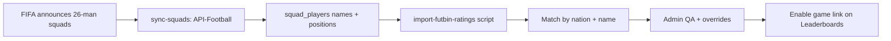

# World Cup XI Mini-Game — Implementation Plan

**Reference:** [38-0-0.com](https://38-0-0.com)  
**Target product:** World Cup 2026 Cooper tipping pool  
**Last updated:** 2026-06-08  
**Status:** Decisions locked — build after final 26-man squads are published  

---

## Locked product decisions

| # | Decision | Your answer |
|---|----------|-------------|
| 1 | **Win condition** | Simulate the **full World Cup**. Outcome is either **“You won the World Cup”** or **“You were knocked out at Round XX”** (e.g. Group stage, Round of 32, Round of 16, Quarter-final, Semi-final, Final). |
| 2 | **Spin pool** | All **48 WC26 nations** (equal weight). |
| 3 | **Placement** | Link on the **Leaderboards page**, **below** the leaderboard sections. Route: `/pools/:poolId/xi-game`. |
| 4 | **Competition** | **Casual only** — no XI-game leaderboard. Optional **“Post to banter box”** on the result screen. |
| 5 | **Main sweep** | **Side game only** — does not affect pool points or odds leaderboard. |
| 6 | **Ratings** | Pull player OVR + attributes from **[FUTBIN](https://www.futbin.com/)** where possible (see §4). |
| 7 | **Squad data** | **Wait for FIFA final 26-man squads** before enabling the game. Until then: “Coming soon” on the link. |

### Defaults (not explicitly answered — recommended)

| Topic | Recommendation |
|-------|----------------|
| **Modes** | Classic + Expert at launch (matches 38-0-0). |
| **Draft pool** | Any player from the nation’s **26-man squad** (not starters-only). |
| **Re-spin** | One free re-spin per game (no ads). |
| **Login** | Must be a **pool member** to play and post banter (matches existing pool gates). |
| **Simulation** | Client-side for v1 (casual side game; no prize integrity requirement). |

---

## 1. What we are building

A **38-0-0-style spin draft** adapted for World Cup 2026:

```
Pick formation + mode
    → Spin random nation (1 of 48)
    → Draft 1 player from that squad into your XI
    → Repeat × 11
    → Simulate full tournament (groups + knockouts)
    → "You won the World Cup" OR "Knocked out at Round of 16"
    → Optional: post result to Banter Box
```

### Result copy examples

| Simulation outcome | User-facing message |
|--------------------|---------------------|
| Win final | **You won the World Cup** |
| Lose semi-final | **You were knocked out in the Semi-final** |
| Lose round of 16 | **You were knocked out in the Round of 16** |
| Fail to advance from group | **You were knocked out in the Group stage** |

Round labels should match existing app stage names where possible (`formatStage` in `web/src/lib/poolBoards.ts`).

---

## 2. UI placement

### Leaderboards page

Add a **card below all leaderboard sections** on `LeaderboardsPage.tsx`:

```
┌─────────────────────────────────────────────┐
│  🎮 World Cup Spin Draft                    │
│  Build an XI from 48 nations and see if     │
│  you can win the World Cup.                 │
│  [ Play now ]  or  [ Coming soon ]          │
└─────────────────────────────────────────────┘
```

- **Before squads sync:** button disabled / “Coming soon — squads not released yet”.
- **After sync:** `Link` to `xi-game` under the pool shell.

### Game route

| Route | Page |
|-------|------|
| `/pools/:poolId/xi-game` | Hub: rules, formation picker, start game |
| `/pools/:poolId/xi-game/play/:sessionId` | Draft board (11 rounds) |
| `/pools/:poolId/xi-game/result/:sessionId` | Outcome + banter share |

Register routes in `web/src/App.tsx` under the existing `PoolShell` layout.

---

## 3. Banter box integration

Reuse `pool_banter_messages` (max **500 characters**).

### Result screen

After simulation, show:

- Primary: **Play again**
- Secondary: **Post to banter box** (only if user is a pool member)

### Pre-filled banter templates

**Won:**
```
🏆 Won the World Cup in Spin Draft! Formation 4-3-3 · Squad OVR 89 · Classic mode
```

**Knocked out:**
```
😤 Knocked out in the Quarter-final — Spin Draft XI (OVR 84, 4-3-3). Who beats that?
```

User can edit before posting. Insert via existing `BanterBox` pattern (`pool_banter_messages.insert`).

No new tables required for banter — only optional `xi_game_sessions` stores the structured result if you want “Play again” history later (not required for casual v1).

---

## 4. Data strategy: squads + FUTBIN ratings

### Two-source model

| Data | Source | When |
|------|--------|------|
| **Who is in the squad** (name, position, shirt #, photo) | **API-Football** `/players/squads?team={id}` | After FIFA publishes final 26-man lists |
| **OVR + attributes** (PAC, SHO, PAS, DRI, DEF, PHY) | **FUTBIN** (EA FC 26 cards) | Same sync window, matched by name + nation |

Gameplay reads **only from Postgres** — never FUTBIN or API-Football during a spin.

### API-Football (roster — required)

You already integrate API-Football for WC (`league=1`, `season=2026`). For each of 48 teams with `api_football_team_id`:

```
GET /players/squads?team={apiTeamId}
→ id, name, position, age, number, photo
```

~48 API calls per full refresh. Throttle like `syncGoalkeepersByTeam` (120 ms between teams).

**Gate:** Admin flag `squads_ready` or row count check (`squad_players` ≥ ~1,100) before enabling the game link.

### FUTBIN (ratings — preferred, with caveats)

**There is no official FUTBIN API.** Ratings must be obtained by:

1. **One-off / scheduled import script** (Node or Python, run locally or as a guarded edge function), not from the browser.
2. Filter FUTBIN players by **nation** (FUTBIN nation id per country) and optionally **Men's National** / World Cup card types when EA releases them.
3. **Fuzzy-match** API-Football squad name → FUTBIN player name (normalize accents, “Kylian Mbappé” vs “Mbappe”).
4. Store matched ratings in `squad_players` columns; unmatched players get a **fallback rating** (see below).

| FUTBIN field | DB column |
|--------------|-----------|
| `rating` (OVR) | `overall_rating` |
| `position` | cross-check `position` |
| `pace`, `shooting`, … | `attr_pace`, `attr_shooting`, … |
| FUTBIN player id | `futbin_player_id` (optional) |

**Risks:**

| Risk | Mitigation |
|------|------------|
| FUTBIN Terms of Service / scraping | Run import **manually or on CI**, respect rate limits (5+ s between pages), store results in DB. Do not scrape from user clients. |
| No WC-specific card for a squad player | Match to **best nation card** on FUTBIN (e.g. France gold card for a French squad player). |
| Name mismatch | Manual admin overrides for top ~50 mismatches. |
| Card not on FUTBIN yet | Fallback: derived rating from API-Football season stats or position-based default (65–72). |

**Fallback formula** (when FUTBIN match fails):

```
overall_rating = clamp(55 + floor(api_season_rating * 5), 50, 88)
```

### Why not FUTBIN-only?

FUTBIN lists **EA FC Ultimate Team cards**, not official FIFA squad announcements. The **26-man list must come from API-Football** (or FIFA) so you only offer players actually at the World Cup.

### Sync pipeline (after squads drop)



---

## 5. Tournament simulation (outline)

### Structure (2026 format)

- **12 groups of 4** — your XI does not replace a real nation; simulation uses **squad strength** vs fictional opponents.
- Simplified v1: treat each match as win/loss based on **XI OVR**, position fit, and random variance.
- Progress: **3 group matches** → if qualify → **R32 → R16 → QF → SF → Final**.

### Knock-out round labels (for “knocked out at…”)

| Internal stage | User message |
|----------------|--------------|
| `group` | Group stage |
| `round_of_32` | Round of 32 |
| `round_of_16` | Round of 16 |
| `quarter_final` | Quarter-final |
| `semi_final` | Semi-final |
| `final` | Final (if lost) |
| `champion` | You won the World Cup |

### Inputs to simulation

- Average `overall_rating` of XI (position-weighted like 38-0-0).
- Optional: use six FUTBIN attributes for Classic mode display only.

### Output JSON (stored on session)

```json
{
  "outcome": "knocked_out",
  "exit_round": "quarter_final",
  "squad_ovr": 87,
  "formation": "4-3-3",
  "mode": "classic",
  "group_record": "2W-0D-1L"
}
```

Tune win probabilities in `web/src/lib/xiGame/simulate.ts` with playtesting — target: winning the World Cup should be rare (~1–5% for strong drafts).

---

## 6. Database schema (draft)

```sql
-- Footballers (not pool members)
squad_players (
  id uuid primary key,
  team_id uuid references teams(id),
  api_football_player_id int,
  futbin_player_id int,
  name text not null,
  position text not null,        -- normalized: GK | DEF | MID | FWD
  position_detail text,          -- LB, ST, etc.
  shirt_number int,
  photo_url text,
  overall_rating int not null,
  attr_pace int, attr_shooting int, attr_passing int,
  attr_dribbling int, attr_defending int, attr_physical int,
  rating_source text,            -- futbin | fallback | manual
  synced_at timestamptz
);

-- Optional: persist games for banter + play again
xi_game_sessions (
  id uuid primary key,
  pool_id uuid references pools(id),
  user_id uuid references auth.users(id),
  formation text not null,
  mode text not null,            -- classic | expert
  status text not null,          -- drafting | complete
  result_json jsonb,
  created_at timestamptz
);

xi_game_picks (
  session_id uuid references xi_game_sessions(id),
  round int,
  spun_team_id uuid references teams(id),
  squad_player_id uuid references squad_players(id),
  slot_position text,
  was_respin boolean default false,
  primary key (session_id, round)
);

-- Feature flag
app_settings (
  key text primary key,
  value jsonb
);
-- e.g. { "xi_game_enabled": false } until squads_ready
```

**RLS:** `squad_players` — authenticated read. `xi_game_sessions` — insert/select own rows + same `pool_id` membership as banter.

---

## 7. Engineering phases

### Phase A — Scaffold (can start now, before squads)

- [ ] Route `/pools/:poolId/xi-game` + “Coming soon” card on `LeaderboardsPage`
- [ ] `xiGame/` lib: formations, position eligibility, spin (48 nations)
- [ ] Draft UI shell with mock data (3 nations) for UX review
- [ ] Simulation stub returning random exit round
- [ ] Result screen + “Post to banter box” wire-up

### Phase B — Data (after final 26-man squads)

- [ ] Migration: `squad_players`, `xi_game_sessions`, `xi_game_picks`
- [ ] Edge function `sync-squads` + cron
- [ ] Script `scripts/import-futbin-ratings.ts` (nation map + fuzzy match)
- [ ] Admin page: sync status, unmatched players, manual OVR override
- [ ] Flip `xi_game_enabled` → enable Leaderboards link

### Phase C — Polish

- [ ] Classic / Expert modes
- [ ] One re-spin per game
- [ ] Mobile-first pitch diagram
- [ ] Simulation balance pass

**Explicitly out of scope (per your answers):**

- XI-game leaderboard
- Pool points / sweep integration
- Live FUTBIN/API calls during gameplay

---

## 8. FUTBIN nation ID map (starter)

Maintain `scripts/futbin-nation-ids.json` mapping `fifa_code` → FUTBIN nation id (e.g. `FRA` → 18). Populate from FUTBIN’s nation filter URLs when running the import script.

Example filter pattern: `https://www.futbin.com/players?nation={id}` — import script paginates with delay.

---

## 9. API quota estimate

| Job | API-Football calls | Frequency |
|-----|-------------------|-----------|
| Full squad sync | ~48 | Once when squads announced; weekly during WC |
| FUTBIN import | 0 (external scrape) | Same window as squad sync |
| Gameplay | 0 | — |

Existing cron budget for fixtures/results/odds is unchanged.

---

## 10. Open questions (minor)

1. **Expert mode at launch?** Recommended yes; confirm if you want Classic-only v1.
2. **Re-spin:** One free re-spin OK?
3. **FUTBIN import:** Comfortable with a **manual/CI script** (not live scraping in production)? Required given no official API.
4. **World Cup FUTBIN cards:** When EA “World’s Game” international cards appear, prefer those over generic nation golds?

---

## 11. Bottom line

| Topic | Answer |
|-------|--------|
| Game type | 38-0-0-style spin draft → **full WC tournament sim** |
| Win message | **You won the World Cup** or **knocked out at Round X** |
| Data | **API-Football** for 26-man squads; **FUTBIN** for OVR/attrs (imported to DB) |
| Where it lives | Link **below leaderboards** in each pool |
| Social | Optional **banter box** post — no competitive leaderboard |
| When to ship data | **After final 26-man squads** |
| Can start now? | **UI scaffold + simulation logic** with mock data; real squads later |

---

*Related: [ProgressSummary.md](../ProgressSummary.md), [TestLiveAPI.md](./TestLiveAPI.md), [Banter migration](../supabase/migrations/20260614000013_pool_banter_box.sql)*
