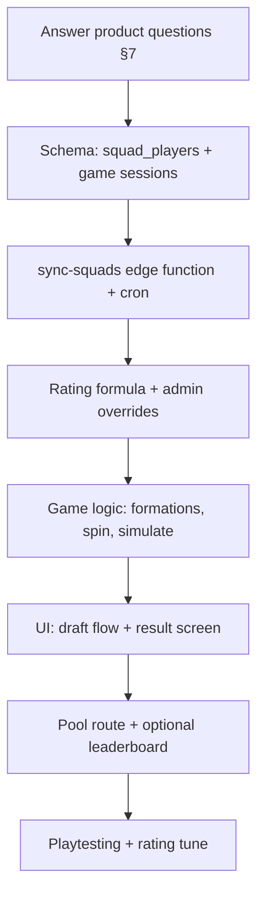

# World Cup XI Mini-Game — Review & Implementation Plan

**Reference:** [38-0-0.com](https://38-0-0.com)  
**Target product:** World Cup 2026 Cooper tipping pool (`NFernie/World-Cup-2026---Cooper`)  
**Date:** 2026-06-08  
**Status:** Planning — awaiting product decisions  

---

## 1. What 38-0-0.com is

[38-0-0](https://38-0-0.com) is a free browser squad-builder with two advertised modes:

| Mode | Concept |
|------|---------|
| **EPL (38-0-0)** | Spin a random **Premier League club + season** → draft 1 player per round → fill an XI in a chosen formation → simulate a **38-game league season** → earn a tier badge (relegation scrap → champions → invincibles → perfect **38-0-0**). |
| **World Cup** | Homepage advertises *“Draft a squad and chase the trophy”* — same draft loop adapted to international football (details are lighter on the public site than the EPL mode). |

### Core loop (EPL — best documented)

1. Pick **Classic** (ratings visible) or **Expert** (names + positions only).
2. Pick a **formation** (4-3-3, 4-4-2, 3-5-2, etc.).
3. **Spin** → random club + season (e.g. Arsenal 2017).
4. **Draft** one player from that squad into a valid position slot.
5. Repeat for **11 rounds**.
6. **Simulate** → projected W-D-L, points, badge, shareable result.
7. Optional **re-spin** (ad-gated on their site).

### Why it works

- **Fast** — one run takes minutes.
- **Shareable** — screenshot-friendly results.
- **Skill + luck** — spin variance keeps replays interesting.
- **Position rules** — players only fit realistic positions (striker can’t play CB).
- **Ratings-driven simulation** — squad OVR + position fit → projected record.

### Data behind 38-0-0

Their FAQ states squads and ratings come from a **public football dataset** (not live API during play). Data is **preloaded**; the game does not call an external API on each spin.

---

## 2. Proposed WC26 variant for this website

A natural adaptation for World Cup 2026:

| 38-0-0 (EPL) | WC26 equivalent (proposed) |
|--------------|----------------------------|
| Spin club + season | Spin **one of the 48 WC26 nations** |
| Draft from that club’s squad | Draft from that nation’s **World Cup squad** |
| 38 league games | **Tournament simulation** (group + knockout), e.g. chase **7-0** (win every match) or “Win the World Cup” tier |
| Premier League history | **2026 World Cup squads only** (your stated requirement) |
| Classic / Expert | Same modes |
| Standalone, no account | **Your choice** — standalone page and/or inside each pool |

### Suggested name directions

- **“Road to 7-0”** — perfect tournament (7 wins, 0 draws, 0 losses) if you mirror the NBA-style “82-0” / WC “7-0” meme.
- **“Build the GOAT XI”** — draft WC26 stars, simulate how far they go.
- **“WC26 Spin Draft”** — descriptive, on-brand with the existing pool.

### Minimum viable game (MVP)

1. User picks formation + mode (Classic/Expert).
2. Eleven draft rounds: spin → nation → pick one footballer into XI.
3. Position eligibility enforced (GK, DEF, MID, FWD families — reuse 38-0-0-style mapping).
4. End screen: simulated tournament result, squad rating, share link/image.
5. Optional: **one re-spin per game** (no ads initially — match your app’s style).

### Stretch features (post-MVP)

- Daily challenge (same spin seed for everyone).
- Pool leaderboard (“best squad rating in Cooper’s pool”).
- 1v1 snake draft with another pool member.
- Tie-in: bonus points in the main sweep if your drafted nation matches your **assigned pool team**.

---

## 3. Do you need API-Football?

**Short answer: yes for names, positions, and photos — but you will likely need a rating strategy on top of raw API data.**

You already use **API-Football (api-sports.io)** for fixtures, scores, odds, and awards. The same provider can supply WC26 player data.

### What API-Football provides today

| Endpoint | Gives you | Good for |
|----------|-----------|----------|
| `GET /players/squads?team={apiTeamId}` | Player **id**, **name**, **position**, age, shirt number, photo | Squad lists — **1 call per nation** (~48 calls for full refresh) |
| `GET /players?team={apiTeamId}&season=2026` | Profile + **season statistics** per competition block; may include `games.rating`, goals, etc. | Richer stats; **paginated** (multiple calls per large squad) |
| `GET /players?league=1&season=2026&page=N` | All players in WC competition | Bulk import; heavy on API quota |
| `GET /fixtures/players?fixture={id}` | **Per-match** rating (0–10) | After matches kick off — useful for live updates, not pre-tournament draft |

### What API-Football does *not* give you out of the box

- A single **FIFA-style “overall” (OVR)** number like 38-0-0 shows (PAC/SHO/PAS/DRI/DEF/PHY).
- Guaranteed **final World Cup squads** before FIFA’s official announcement (typically late May / early June 2026).
- Stable ratings for players who only appear on the bench at club level.

### Recommended data approach

```
┌─────────────────────────────────────────────────────────────┐
│ 1. Sync squads (API-Football /players/squads)               │
│    → store in Postgres: name, position, api_player_id, team │
├─────────────────────────────────────────────────────────────┤
│ 2. Enrich ratings (choose one or blend)                     │
│    A) API club-season rating average (players?team&season)  │
│    B) Derived OVR from goals/assists/minutes (formula)      │
│    C) Manual admin overrides for stars / missing data       │
│    D) Optional third-party OVR seed (SoFIFA etc.) — legal?  │
├─────────────────────────────────────────────────────────────┤
│ 3. Serve game from YOUR database (not live API per spin)    │
│    → fast, cacheable, works offline from API outages        │
└─────────────────────────────────────────────────────────────┘
```

**You do not need to call API-Football during gameplay.** Sync on a schedule (same pattern as `sync-tournament-awards`), then the mini-game reads Postgres — exactly how 38-0-0 uses a preloaded dataset.

### API quota impact (rough)

| Action | Calls | Frequency |
|--------|-------|-----------|
| Full squad refresh (48 teams) | ~48 (`/players/squads`) | Daily until squads firm, then weekly |
| Rating enrichment per team | ~48–150 (`/players?team=` paginated) | Weekly or after squad announcement |
| Live rating updates during WC | 1 per finished match (`/fixtures/players`) | Optional; only if you want post-kickoff rating drift |

Your repo already throttles awards sync (~120 ms between team calls) and gates cron jobs. A new `sync-squads` function fits the same pattern.

### Alternatives to API-Football

| Source | Pros | Cons |
|--------|------|------|
| **API-Football** (current) | Already integrated; WC league id `1`, season `2026` | No native OVR; quota limits |
| **Manual CSV / admin UI** | Full control for demo before squads drop | Labour-intensive; stale data |
| **FIFA / SoFIFA / FM data** | Realistic OVR | Licensing, scraping, maintenance |
| **Wikipedia / open lists** | Free names | No ratings; no positions standard |

**Recommendation:** Start with **API-Football for squads + a derived `overall_rating` column** you control. Add admin overrides for the top ~200 players users will actually draft.

---

## 4. What the current website already has (relevant pieces)

| Asset | Status |
|-------|--------|
| 48 nations in `teams` | ✅ Seeded (`fifa_code`, `group_letter`, `api_football_team_id`) |
| API-Football team mapping | ✅ `sync-tournament-awards` |
| Player names in DB | ⚠️ Only goal scorers (`match_events`) + golden boot/glove on `teams` |
| Full squads in DB | ❌ Not stored |
| Positions / ratings in DB | ❌ Not stored |
| Coach + captain | ✅ Static `web/src/lib/teamStaff.ts` |
| Pool auth + routing | ✅ `/pools/:poolId/...` shell |
| Leaderboard patterns | ✅ SQL views + `LeaderboardsPage` |

**Naming warning:** In this codebase, “player” usually means **pool member** (human). New tables should use names like `squad_players` or `footballers` to avoid clashing with `pool_members` and `formatPlayerLine()`.

---

## 5. What we need to add (technical breakdown)

### Phase 0 — Product decisions (you)

Answer the questions in **§7** before build. Several choices change schema and routing.

### Phase 1 — Data layer

**New migration(s):**

```sql
-- Illustrative — final schema depends on your answers
squad_players (
  id uuid PK,
  team_id uuid FK → teams,
  api_football_player_id int unique,
  name text,
  position text,           -- GK | DEF | MID | FWD (normalized)
  position_detail text,    -- e.g. Left-Back, from API
  shirt_number int,
  photo_url text,
  overall_rating int,      -- 1–99 game rating for simulation
  pace, shooting, ...      -- optional Classic mode attrs
  rating_source text,      -- api | derived | manual
  synced_at timestamptz
)

xi_game_sessions (
  id uuid PK,
  user_id uuid FK,
  pool_id uuid FK nullable,  -- null = public standalone
  mode text,                 -- classic | expert
  formation text,
  status text,               -- drafting | complete
  result_json jsonb,         -- simulation output
  created_at timestamptz
)

xi_game_picks (
  session_id uuid FK,
  round int,
  spun_team_id uuid FK,
  squad_player_id uuid FK,
  slot_position text,        -- e.g. LB, ST
  was_respin boolean
)
```

**New edge function:** `sync-squads` (or extend `sync-tournament-awards`)

- Input: `API_FOOTBALL_LEAGUE_ID=1`, `API_FOOTBALL_SEASON=2026`
- Steps: ensure `api_football_team_id` → fetch squads → upsert `squad_players` → compute/merge ratings
- Cron: daily pre-tournament; twice weekly during WC

**Rating formula (example MVP):**

```
overall_rating = clamp(
  40 + (api_season_rating * 6) + position_bonus,
  45, 94
)
```

Tune against known stars (Mbappé, Messi, etc.) in admin review.

### Phase 2 — Game logic (shared library)

New package or folder: `web/src/lib/xiGame/` (or `shared/` if simulation runs server-side)

| Module | Responsibility |
|--------|----------------|
| `formations.ts` | Slot definitions + eligibility matrix (port from 38-0-0 rules) |
| `spin.ts` | Weighted random nation; avoid repeats if desired |
| `draft.ts` | Validate pick vs slot + already-used players |
| `simulate.ts` | Nation OVR + position fit → match outcomes → knockout bracket |
| `tiers.ts` | Badge names (Group exit, QF, Final, Champion, 7-0) |

Simulation can be **client-side** for MVP (fast, no server cost) if you accept that expert players could inspect network tab — or **server-side RPC** `complete_xi_game(session_id)` for integrity.

### Phase 3 — UI

| Screen | Route (suggested) |
|--------|-------------------|
| Game hub / rules | `/pools/:poolId/xi-game` or `/xi-game` (public) |
| Draft board | Spin animation + player picker grid |
| Result / share | Record, badge, squad summary, “Play again” |
| Pool leaderboard | Tab on leaderboards or dedicated board |

**Components to build:**

- `FormationPicker`, `SpinReel`, `PlayerDraftGrid`, `XiPitchDiagram`, `SimulationResultCard`
- Reuse: `TeamFlag`, `Card`, pool theme via `PoolShell`

### Phase 4 — Integration & ops

- Link from `PoolPage` and/or home (`HomePage`)
- Optional: `leaderboard_xi_game` view (best tier / highest squad OVR per pool)
- Admin: override ratings, force re-sync, disable game until squads ready
- Docs: API quota budget alongside existing `TestLiveAPI.md`

### Phase 5 — Polish

- Share image (canvas / OG meta)
- Daily seed challenge
- Analytics (Plausible/GA if you add later)

---

## 6. Effort & dependency summary

| Workstream | Depends on | Risk |
|------------|------------|------|
| Squad sync | API-Football key, squads published | Squads incomplete until ~June 2026 |
| Ratings | Formula + manual QA | Users expect Messi > random bench player |
| Simulation tuning | Playtesting | Too easy/hard breaks replay value |
| UI draft flow | Formation + position rules | Largest frontend chunk |
| Pool integration | Your answer on scope | Optional for MVP |

**MVP without pool tie-in:** data sync + standalone `/xi-game` route + local/session storage for anonymous users, or reuse Supabase auth for saved runs.

**MVP with pool tie-in:** add `pool_id` to sessions + one new leaderboard column.

---

## 7. Questions for you (please answer)

These block detailed implementation:

### Game design

1. **Tournament goal:** Mimic perfect **7-0** (win every match), **win the World Cup**, or a **points-based season-style** score across a fixed number of games?
2. **Spin source:** Random from all **48 nations**, or only nations **already in the user’s pool**, or weighted toward the user’s **assigned team**?
3. **Draft pool per spin:** Any player from the spun nation’s **26-man squad**, or restrict to **likely starters** (top 11 by rating)?
4. **Modes:** Both **Classic + Expert** at launch, or Classic only?
5. **Re-spin:** Allow one re-spin per game? Free or gated (ads — 38-0-0 uses ads)?

### Product placement

6. **Standalone vs pool:** Public game anyone can play, **only inside a pool**, or both?
7. **Account required:** Must users be logged in to save results and appear on a pool leaderboard?
8. **Leaderboard:** Global high scores, per-pool only, or no leaderboard (pure casual)?
9. **Link to main sweep:** Should XI game results affect **pool points**, or stay a **side game**?

### Data & legal

10. **Rating source priority:** OK to use **derived ratings** from API stats (not official FIFA OVR)? Any desire to manually curate top players?
11. **Squad timing:** Launch before official squads with **provisional lists**, or wait until **final 26-man squads** (likely early June 2026)?
12. **Photos:** Show API player photos in the draft UI (check API-Football / FIFA image terms)?

### Technical

13. **Simulation integrity:** Client-side OK for v1, or must results be **server-validated**?
14. **Mobile:** Primary device for draft (38-0-0 is very mobile-friendly) — confirm mobile-first layout?

---

## 8. Recommended implementation order



1. **Week 0:** Decisions + sample squad sync for 3 nations (smoke test API).
2. **Phase 1:** Full 48-nation sync + `squad_players` table.
3. **Phase 2:** Simulation library + unit tests on known XIs.
4. **Phase 3:** Draft UI (biggest UX piece).
5. **Phase 4:** Pool hook + share.
6. **Phase 5:** Leaderboard + daily challenge if wanted.

---

## 9. Bottom line

| Question | Answer |
|----------|--------|
| Can we add a 38-0-0-style game for WC26? | **Yes** — spin nation → draft 11 → simulate tournament. |
| Do we need API-Football? | **Yes for squad data** (names, positions, IDs, photos). **Not for live calls during play.** |
| Do we need something beyond API-Football? | **Yes for OVR-style ratings** unless you hide ratings (Expert mode only) or derive them. |
| Biggest gap in current repo? | **No `squad_players` table** — only national teams and a few award/scorer fields exist today. |
| Biggest product risk? | **Squads and ratings quality** before the tournament starts; simulation balance second. |

---

## 10. Next step

Reply with answers to **§7** (even short bullets). With those, we can produce:

- Final schema migration draft
- Exact simulation rules (win probabilities / tiers)
- UI wireframe list and route map
- API sync schedule and quota estimate for your current API-Football plan tier

---

*Related docs: [ProgressSummary.md](../ProgressSummary.md), [TestLiveAPI.md](./TestLiveAPI.md), [PLAN.md](../PLAN.md)*
